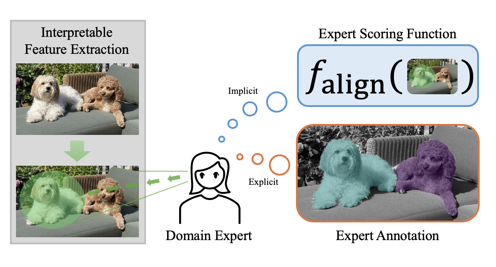

# The FIX Benchmark: Extracting Features Interpretable to eXperts

[](https://pypi.org/project/exlib/)
[](https://github.com/BrachioLab/exlib/blob/master/LICENSE)

[<a href="https://github.com/BrachioLab/brachiolab.github.io/blob/live/fix/jin2024fix.pdf">Paper</a>] [<a href="https://brachiolab.github.io/fix/">Website</a>] 

Official implementation for "The FIX Benchmark: Extracting Features Interpretable to eXperts".

Authors: Helen Jin, Shreya Havaldar, Chaehyeon Kim, Anton Xue, Weiqiu You, Helen Qu, Marco Gatti, Daniel A Hashimoto, Bhuvnesh Jain, Amin Madani, Masao Sako, Lyle Ungar, Eric Wong.

## Overview
FIX is a benchmark for **extracting features that are interpretable to real-world experts**, spanning diverse data modalities and applications, from doctors performing gall bladder surgery to cosmologists studying supernovae. The FIX benchmark allows domains to measure alignment of extracted features with expert features either *implicitly* with a scoring function or *explicitly* with expert annotations.



The FIX package contains:

 * Data loaders that automatically handle data downloading, processing, and splitting, and
 * Dataset evaluators that standardize model evaluation for each dataset.

In addition, we include an example script that runs all baselines for every setting.

<!-- For more information, please visit [our website](https://brachiolab.github.io/fix/) or read the main FIX [paper](https://github.com/BrachioLab/brachiolab.github.io/blob/live/fix/jin2024fix.pdf). -->
<!-- For questions and feedback, please post on the [discussion board](https://github.com/BrachioLab/exlib/discussions). -->

## Getting Started
### Installation
To use FIX, you must first install the exlib package (which has a separate README outside this FIX folder), as follows:
```
pip install exlib
```

If you have exlib already installed, please check that you have the latest version:
```
python -c "import exlib; print(exlib.__version__)"
# This should print "0.0.2". If it does not, update the package by running:
pip install -U exlib
```

### FIX Notebooks
Tutorial notebooks for each FIX setting are located in the [../notebooks/fix](https://github.com/BrachioLab/exlib/blob/master/notebooks/fix) folder.
The main dependencies needed to run them are all installed in exlib or alternatively you can use our [Dockerfile](https://github.com/BrachioLab/dockerfiles/blob/main/riceric22/exlib/Dockerfile).

### FIX Baselines
To run all baselines for every dataset setting, you can run the following script:
```
./run_fix_baselines.sh
```
The baseline feature extractors for differenet data modalities (e.g. text, time series, data) are located in the [../src/exlib/features](https://github.com/BrachioLab/exlib/blob/master/src/features) folder.

## Datasets
FIX currently includes 6 datasets, which we've briefly listed below. All datasets and models are hosted on Huggingface (see links in table). For full dataset descriptions, please see our [paper](https://github.com/BrachioLab/brachiolab.github.io/blob/live/fix/jin2024fix.pdf).

| Dataset                 | Modality    | Labeled splits   | Expert Features  | Links             |
| ----------------------- | ----------- | ---------------- | ---------------- | ----------------- | 
| massmaps                | Image       | train, val, test | Implicit         | [<a href="https://huggingface.co/datasets/BrachioLab/massmaps-cosmogrid-100k">dataset</a>] [<a href="https://huggingface.co/BrachioLab/massmaps-conv">model</a>] | 
| supernova               | Time Series | train, val, test | Implicit         | [<a href="https://huggingface.co/datasets/BrachioLab/supernova-timeseries">dataset</a>] [<a href="https://huggingface.co/BrachioLab/supernova-classification">model</a>] |
| multilingual_politeness | Text        | train, val, test | Implicit         | [<a href="https://huggingface.co/datasets/BrachioLab/multilingual_politeness">dataset</a>] [<a href="https://huggingface.co/BrachioLab/xlm-roberta-politeness">model</a>] |
| emotion                 | Text        | train, val, test | Implicit         | [<a href="https://huggingface.co/datasets/BrachioLab/emotion">dataset</a>] [<a href="https://huggingface.co/BrachioLab/roberta-base-go_emotions">model</a>] |
| chestx                  | Image       | train, test      | Explicit         | [<a href="https://huggingface.co/datasets/BrachioLab/chestx">dataset</a>] [<a href="https://huggingface.co/BrachioLab/chestx_pathols">model</a>] |
| cholec                  | Image       | train, test      | Explicit         | [<a href="https://huggingface.co/datasets/BrachioLab/cholecystectomy">dataset</a>] [<a href="https://huggingface.co/BrachioLab/cholecystectomy_gonogo">model</a>] | 

## Citation
Please cite the FIX paper as follows if you use the data or code from the FIX benchmark:
```bibtex
@misc{jin2024fix,
  title={The FIX Benchmark: Extracting Features Interpretable to eXperts},
  author={Helen Jin and Shreya Havaldar and Chaehyeon Kim and Anton Xue and Weiqiu You and Helen Qu and Marco Gatti and Daniel A Hashimoto and Bhuvnesh Jain and Amin Madani and Masao Sako and Lyle Ungar and Eric Wong},
  year={2024},
}
```

### Original Datasets Citations
We also include the original datasets' citations for reference.

#### Mass Maps:
```bibtex
@article{kacprzak2023cosmogridv1,
  title={CosmoGridV1: a simulated 𝗐CDM theory prediction for map-level cosmological inference},
  author={Kacprzak, Tomasz and Fluri, Janis and Schneider, Aurel and Refregier, Alexandre and Stadel, Joachim},
  journal={Journal of Cosmology and Astroparticle Physics},
  volume={2023},
  number={02},
  pages={050},
  year={2023},
  publisher={IOP Publishing}
}
```
#### Supernova:
```bibtex
@article{allam2018photometric,
  title={The photometric lsst astronomical time-series classification challenge (plasticc): Data set},
  author={Allam Jr, Tarek and Bahmanyar, Anita and Biswas, Rahul and Dai, Mi and Galbany, Llu{\'\i}s and Hlo{\v{z}}ek, Ren{\'e}e and Ishida, Emille EO and Jha, Saurabh W and Jones, David O and Kessler, Richard and others},
  journal={arXiv preprint arXiv:1810.00001},
  year={2018}
}
```

#### Multilingual Politeness:
```bibtex
@inproceedings{havaldar2023multilingual,
  title={Multilingual Language Models are not Multicultural: A Case Study in Emotion},
  author={Havaldar, Shreya and Singhal, Bhumika and Rai, Sunny and Liu, Langchen and Guntuku, Sharath Chandra and Ungar, Lyle},
  booktitle={Proceedings of the 13th Workshop on Computational Approaches to Subjectivity, Sentiment, \& Social Media Analysis},
  pages={202--214},
  year={2023}
}
```

#### Emotion:
```bibtex
@inproceedings{demszky2020goemotions,
  title={GoEmotions: A Dataset of Fine-Grained Emotions},
  author={Demszky, Dorottya and Movshovitz-Attias, Dana and Ko, Jeongwoo and Cowen, Alan and Nemade, Gaurav and Ravi, Sujith},
  booktitle={Proceedings of the 58th Annual Meeting of the Association for Computational Linguistics},
  pages={4040--4054},
  year={2020}
}
```

#### Chest X-Ray:
```bibtex
@article{majkowska2020chest,
  title={Chest radiograph interpretation with deep learning models: assessment with radiologist-adjudicated reference standards and population-adjusted evaluation},
  author={Majkowska, Anna and Mittal, Sid and Steiner, David F and Reicher, Joshua J and McKinney, Scott Mayer and Duggan, Gavin E and Eswaran, Krish and Cameron Chen, Po-Hsuan and Liu, Yun and Kalidindi, Sreenivasa Raju and others},
  journal={Radiology},
  volume={294},
  number={2},
  pages={421--431},
  year={2020},
  publisher={Radiological Society of North America}
}
```

#### Laparoscopic Cholecystectomy Surgery:
```bibtex
@article{stauder2016tum,
  title={The TUM LapChole dataset for the M2CAI 2016 workflow challenge},
  author={Stauder, Ralf and Ostler, Daniel and Kranzfelder, Michael and Koller, Sebastian and Feu{\ss}ner, Hubertus and Navab, Nassir},
  journal={arXiv preprint arXiv:1610.09278},
  year={2016}
}

@article{twinanda2016endonet,
  title={Endonet: a deep architecture for recognition tasks on laparoscopic videos},
  author={Twinanda, Andru P and Shehata, Sherif and Mutter, Didier and Marescaux, Jacques and De Mathelin, Michel and Padoy, Nicolas},
  journal={IEEE transactions on medical imaging},
  volume={36},
  number={1},
  pages={86--97},
  year={2016},
  publisher={IEEE}
}
```

## Contact
Please reach out to us if you have any questions or suggestions. You can submit an issue or pull request, or send an email to helenjin@seas.upenn.edu.

Thank you for your interest in the FIX benchmark.


